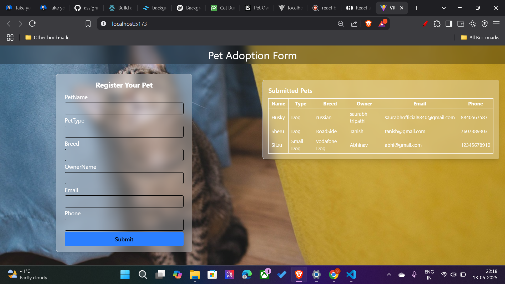

Demo of Pet_Adoption website is here 

# 🐾 Pet Adoption Form

A simple and elegant React + Tailwind CSS web app for registering pets for adoption and displaying submitted entries in a clean table format.

---

## 📸 Preview

---

## 🚀 Features

- 🐶 Register pet name, type, breed, and owner details
- 📋 View submitted pet entries in a styled table
- 🎨 Beautiful, blurred glassmorphism UI with background image
- ⚡ Powered by **React**, **Vite**, and **Tailwind CSS**

---

## 🛠 Tech Stack

- React
- Vite
- Tailwind CSS

---

## 📂 Folder Structure

# React + Vite

This template provides a minimal setup to get React working in Vite with HMR and some ESLint rules.

Currently, two official plugins are available:

- [@vitejs/plugin-react](https://github.com/vitejs/vite-plugin-react/blob/main/packages/plugin-react) uses [Babel](https://babeljs.io/) for Fast Refresh
- [@vitejs/plugin-react-swc](https://github.com/vitejs/vite-plugin-react/blob/main/packages/plugin-react-swc) uses [SWC](https://swc.rs/) for Fast Refresh

## Expanding the ESLint configuration

If you are developing a production application, we recommend using TypeScript with type-aware lint rules enabled. Check out the [TS template](https://github.com/vitejs/vite/tree/main/packages/create-vite/template-react-ts) for information on how to integrate TypeScript and [`typescript-eslint`](https://typescript-eslint.io) in your project.
